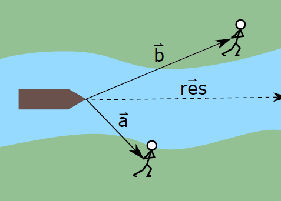
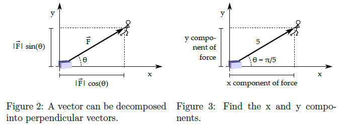

# Assignment 2 - Vector Fun

## Vector Basics

#### (a)  A point is given in a coordinate system: B = (7; 8). What is the vector going from (0; 0) to B?  

   
  
#### (b) Two points, A and B, in a coordinate system are given by A = (4; 3), B = (7; 8). The vector  goes from A to B What is  ?   

  

#### (c) Given vector , what is its magnitude  (its length)?   

    
  
Two guys are pulling a boat on a river, each on their side, as seen on Figure 1.  
The pulls from our heroes are given as  and  respectively.  
  

  

#### (d) What is the resulting vector of their combined pull ?  

  
  

#### (e) Given the vectors,  calculate:

1.   
2.   
3. 
4. 
5.   
  
## Vector Decomposition
  
  
#### (f) In Figure 3, what is the x-component of the force applied?What is the y-component?  

  

  
  
#### (g) In Figure 3, what is the vector of the force   
  

  
  

  
  
#### (h) Having found the x-component(let's call it ) and the y-component (let's call it ), find  

  

## Multiplication of a Vector with a Scalar
When multiplying with a scalar, each component is multiplied with the scalar.    

#### (i) Given  and , what is *b*? 

  

#### (j) What is the length of ?  

#### (k) What is the length of ?
  

#### (l) What is the result of  ?

#### (m) What is the result of  ?

   
   
## Unit Vectors
Unit vectors have a magnitude of 1. The unit vector of a vector  is denoted ,
and points exactly in the same direction as  { it just has the magnitude of 1.  
  
   

**Example:** Given  , its unit vector would be   
**Example:** Given , its unit vector would be   

    
#### (n) Given any vector, how can you find it's unit vector?
To find a unit vector with the same direction as a given vector, we divide the vector by its magnitude - Byju's  
Example: 

#### (o) What is the unit vector of 
  
  

#### (p) What is the unit vector of   
  
  
    
   
    

## Dot Product / Scalar Product

The product (multiplication) of two vectors is called the dot product or the
scalar product (confusing { I know! We will stick to the term \dot product").  
The dot product of two vectors  and  is given by   

Where  is the angle between the two vectors. It is important to not use X to denote the scalar product. That is reserved for a diferent product - namely the vector product or cross product.  

#### (q) Given two vectors , and , calculate . Notice they're parallel!  
  
  

#### (r) Given two vectors,  and , calculate . Notice, they are perpendicular!  
  

  
## Python
#### (s) Using Python and numpy, implement a mag(vec) function to return the magnitude (length) of a 2-dimensional vector (as a numpy array).

